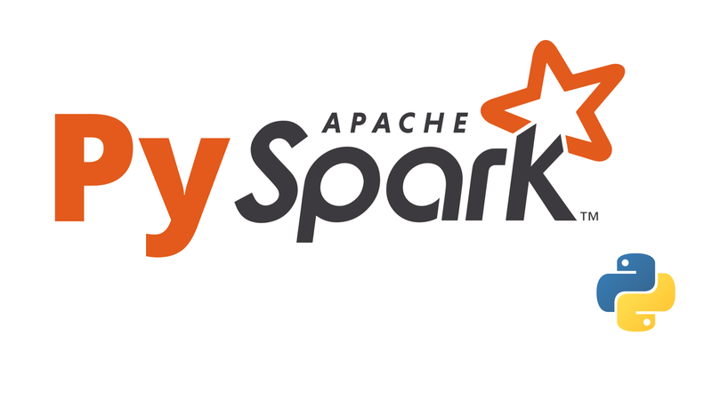

# **Purchase Propensity Model - XGBoost on Databricks**





An end-to-end MLOps pipeline that predicts the probability of a customer making a purchase within the next 30 days. Built on Databricks with Unity Catalog, MLflow, and Hyperopt, and designed to run as a **Databricks Asset Bundle (DAB)**.

## Overview

This project trains a binary XGBoost classifier on customer behavior and transactional data, performs automated hyperparameter optimization, and deploys the winning model to Unity Catalog for high-throughput batch scoring. The full pipeline covers feature engineering -> hyperparameter tuning -> training -> model registration -> batch inference, with all experiment tracking handled by MLflow.

**Target Variable**: `Purchased Next 30D` (_binary: did the customer purchase within the next 30 days?_)

## Project Structure 

```

    ├── config/
    │   ├── pipeline_config.yaml          # Unity Catalog paths, table names, ML settings
    │   ├── best_xgboost_params.yaml      # Output: best params written by hyperparameter_tuning.py
    │   └── best_model_meta.yaml          # Output: registered model URI/version written by train.py
    │
    ├── src/
    │   ├── feature_generation.py         # Feature cleaning, null imputation, Gold table creation (training data)
    │   ├── hyperparameter_tuning.py      # Hyperopt search over XGBoost params, logs to MLflow
    │   ├── train.py                      # Final model training, evaluation, MLflow registration
    │   └── batch_inference.py            # Batch scoring pipeline; writes predictions to Unity Catalog
    │
    └── requirements.txt

```

## Pipeline Architecture

```

    Raw Data (Unity Catalog Silver)
            │
            ▼
    feature_generation.py
    • Drop leakage & metadata columns
    • Null imputation (0.0 for numerics, "UNKNOWN" for categoricals)
    • Standardize column names
    • Write Gold table + ZORDER optimization
            │
            ▼
    hyperparameter_tuning.py
    • StringIndexer → VectorAssembler (Spark ML Pipeline)
    • 80/20 train/val split (seed=42)
    • Hyperopt TPE search over learning_rate, max_depth, n_estimators
    • All child runs logged to MLflow
    • Best params → config/best_xgboost_params.yaml
            │
            ▼
    train.py
    • Re-fit on full training data with best params
    • Save fitted Spark feature pipeline to Unity Catalog Volume
    • Log metrics, params, and model artifact to MLflow
    • Register model to Unity Catalog Model Registry
    • Model metadata → config/best_model_meta.yaml
            │
            ▼
    batch_inference.py
    • Preprocess scoring data via feature_generation logic
    • Validate model is in READY state before scoring
    • Load registered model + saved feature pipeline
    • Score all customers → propensity_score + propensity_label
    • Write results to customer_propensity_predictions Delta table

```

## Configuration

All runtime parameters live in `config/pipeline_config.yaml`:

```yaml

    unity_catalog:
        catalog_name: workspace
        schema_name: default

    tables:
        training_data: "synthetic_propensity_model_training_data"
        scoring_data: "synthetic_propensity_model_scoring_data"
        processed_training_data: "final_xgboost_input_matrix_training"
        processed_scoring_data: "final_xgboost_input_matrix_scoring"

    ml_settings:
        target_column: "Purchased Next 30D"
        model_registry_name: "workspace.default.purchase_propensity_xgb"

```

## Feature Engineering

The pipeline applies consistent preprocessing across both training and scoring paths:

### Leakage & metadata columns dropped

* `Customer Name` - identity metadata
* `Last Purchase Date` - redundant with `Days Since Last Purchase`
* `Synthetic True Propensity` - direct target proxy
* `Next 30D Spend` - post-event leakage

### Imputation strategy

* Numerical features -> filled with 0
* Categorical features -> filled with `UNKNOWN` 

### Feature encoding

Categorical features are label-encoded via Spark's `StringIndexer` before being assembled into a dense feature vector with `VectorAssembler`. The fitted pipeline is persisted to a Unity Catalog Volume so training and inference transformations are guaranteed to be identical.

## Model Training & Tuning

Hyperparameter search is conducted with **Hyperopt** using the TPE algorithm over the following space:

Parameter|Search Space
-|-
`max_depth`|{4, 5, 6, 8}
`learning_rate`|log-uniform [0.0001, 0.1]
`n_estimators`|{50, 100, 150, 200}

Each trial logged as a child MLflow run under a single parent experiment. After 8 evaluations, the best parameters are serialized to `config/best_xgboost_params.yaml`.

**Validation Metric**: ROC-AUC on a held-out 20% validation split.

Best discovered parameters:

```yaml

    learning_rate: 0.04627
    max_depth: 5
    n_estimators: 100
```

## Model Evaluation

The following metrics are logged to MLflow on the validation set after final training:

- ROC-AUC (`val_roc_auc`)
- Accuracy (`val_accuracy`)
- F1 Score (`val_f1`)
- Precision (`val_precision`)
- Recall (`val_recall`)

The registered model is versioned in Unity Catalog under `workspace.default.propensity_model_xgboost`. Batch inference validates that the target model version is in `READY` state before scoring begins, preventing silent failures from a degraded or mid-registration model.

## Batch Inference Output

Predictions are written to `workspace.default.customer_propensity_predictions` as a Delta table with the following schema:

Column|Type|Description
-|-|-
`customer_id`|string|Customer identifier
`propensity_score`|float|Predicted probability of purchase (0-1)
`propensity_label`|int|Binary prediction (0 or 1)
`model_name`|str|Registered model name
`model_version`|int|Model version used for scoring
`scored_at`|string|UTC timestamp of scoring run

## Requirements

```

    mlflow==3.8.1
    pandas==2.2.3
    psutil==5.9.0
    scikit-learn==1.6.1
    xgboost==3.2.0
```

This project targets a Databricks Runtime with Spark pre-installed. PySpark and Hyperopt are provided by the Databricks Runtime and do not need to be installed separately.

## Running the Pipeline

Each module can be run standalone or orchestrated as a Databricks Asset Bundle job. The intended execution order is:

```bash

    # 1. Generate Gold feature table from raw training data
    python src/feature_generation.py

    # 2. Run hyperparameter search
    python src/hyperparameter_tuning.py

    # 3. Train and register the final model
    python src/train.py

    # 4. Score the customer base
    python src/batch_inference.py
```

All scripts read config from `../config/pipeline_config.yaml` by default (relative to `src/`).

## MLflow Experiment Tracking

All runs are tracked in the Databricks-managed MLflow instance. Key artifacts logged per run:

- Hyperopt child runs: per-trial AUC scores and hyperparameter combinations
- Training run: final metrics, best params, serialized XGBoost model, input example
- Model registration: versioned entry in Unity Catalog Model Registry with full lineage back to the source run

The `run_id` and model URI for the production model are written to `config/best_model_meta.yaml` after each successful training run, providing a lightweight handoff between the training and inference stages.